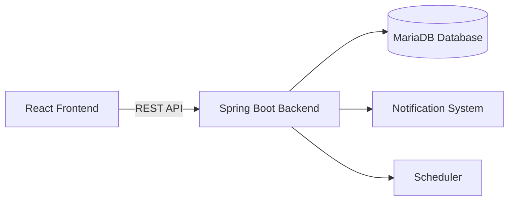
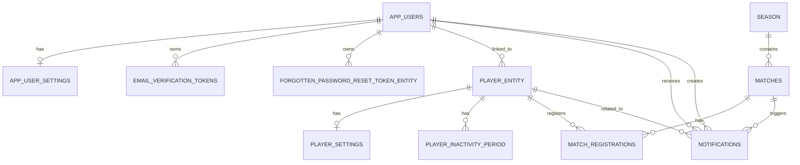

# HobbyHokej-demo

 


Webová aplikace pro správu hobby hokejových zápasů, registrací hráčů,
sezón, statistik a notifikační komunikace mezi organizátory a hráči.

Projekt je implementován jako **full‑stack webová aplikace** postavená
na technologickém stacku:

**Java Spring Boot + React + Vite + MariaDB**

Aplikace umožňuje organizaci hobby hokejových zápasů, správu hráčských
registrací, evidenci výsledků a výpočet statistik.

Projekt slouží jako **ukázka návrhu plnohodnotné vícevrstvé webové
aplikace**.

------------------------------------------------------------------------

# Obsah

# Obsah

- [Popis projektu](#popis-projektu)
- [Hlavní funkce systému](#hlavní-funkce-systému)
- [Architektura systému](#architektura-systému)
- [Doménový model](#doménový-model)
- [Registrace hráče na zápas](#registrace-hráče-na-zápas)
- [Použité technologie](#použité-technologie)
- [Projektová struktura](#projektová-struktura)
- [REST API](#rest-api)
- [Bezpečnost](#bezpečnost)
- [Uživatelské role](#uživatelské-role)
- [Notifikační systém](#notifikační-systém)
- [Databázový model](#databázový-model)
- [Audit změn](#audit-změn)
- [Spuštění aplikace](#spuštění-aplikace)
- [Link na demo aplikaci](#Link-na-demo-aplikaci)
- [Dokumentace](#dokumentace)
- [Možná budoucí rozšíření](#možná-budoucí-rozšíření)
- [Autor](#autor)
- [Licence](#licence)

------------------------------------------------------------------------

# Popis projektu

Aplikace **HobbyHokej** slouží ke správě amatérských hokejových zápasů a
organizaci hráčských registrací.

Systém umožňuje:

-   evidenci hráčů, uživatelů a sezón
-   správu zápasů
-   přihlašování a odhlašování hráčů
-   výběr týmu a pozice na ledě
-   sledování kapacity zápasu
-   evidenci omluvenek a náhradníků
-   správu notifikací
-   vyhodnocení výsledků zápasů
-   výpočet hráčských statistik v rámci sezóny
-   oddělené rozhraní pro administrátora a běžného hráče

Projekt byl vytvořen jako ukázka návrhu **vícevrstvé webové aplikace** s
důrazem na:

-   čistou architekturu
-   práci s DTO
-   oddělení frontend a backend vrstvy
-   zabezpečení přístupu podle rolí
-   přehledné a responzivní uživatelské rozhraní

------------------------------------------------------------------------

# Hlavní funkce systému

Systém zajišťuje:

-   řízení kapacity a obsazenosti pozic
-   evidenci registrací (hráč, tým, pozice)
-   přehled náhradníků a omluvených
-   vyhodnocení výsledků zápasů
-   výpočet hráčských statistik v rámci sezóny
-   auditní historii změn
-   notifikační mechanismus (email, SMS, in‑app)

------------------------------------------------------------------------

# Architektura systému

Aplikace je rozdělena do dvou hlavních částí.

## Architektonický diagram



Backend je implementován jako **modulární monolit s vícevrstvovou
architekturou**.

Základní vrstvy backendu:

-   Controller -- REST endpointy
-   Service -- business logika
-   Repository -- přístup k databázi
-   DTO + Mapper -- API kontrakty
-   Security -- autentizace a autorizace
-   Notification subsystem -- notifikace
-   Scheduler -- plánované úlohy
-   Database layer -- Flyway migrace a auditní triggery

------------------------------------------------------------------------

# Doménový model

Hlavní entity systému:

-   AppUser -- uživatelský účet
-   Player -- hráč propojený s uživatelem
-   Season -- hokejová sezóna
-   Match -- zápas
-   MatchRegistration -- registrace hráče na zápas
-   Notification -- aplikační notifikace

Každá důležitá entita má také **history tabulku pro audit změn**.

------------------------------------------------------------------------

# Registrace hráče na zápas

Typický tok registrace:

1.  hráč se přihlásí do aplikace
2.  frontend načte seznam zápasů
3.  hráč zvolí zápas
4.  hráč vybere tým a pozici
5.  frontend odešle požadavek na backend
6.  backend ověří kapacitu a dostupnost
7.  registrace je uložena do databáze

Backend také automaticky řeší:

-   přesuny mezi stavem REGISTERED / RESERVED
-   kontrolu neaktivity hráče
-   aktualizaci statistik

------------------------------------------------------------------------

# Použité technologie

## Backend

-   Java 17
-   Spring Boot 3
-   Spring Security
-   Spring Data JPA
-   Hibernate
-   MariaDB
-   Flyway
-   MapStruct
-   Maven

## Frontend

-   React
-   Vite
-   JavaScript
-   Bootstrap 5
-   CSS
-   Axios

## Další nástroje

-   Git
-   GitHub
-   Javadoc
-   JSDoc

------------------------------------------------------------------------

# Projektová struktura

    HobbyHokej-demo
    │
    ├── backend
    │   ├── src/main/java/cz/phsoft/hokej
    │   ├── src/main/resources
    │   ├── docs
    │   │   └── Javadoc
    │   └── pom.xml
    │
    ├── frontend
    │   ├── src
    │   ├── docs
    │   ├── package.json
    │   └── vite.config.js
    │
    ├── README.md
    └── .gitignore

------------------------------------------------------------------------

# REST API

Backend poskytuje **JSON REST API používané frontendem**.

Hlavní endpointy:

-   `/api/auth`
-   `/api/users`
-   `/api/players`
-   `/api/matches`
-   `/api/registrations`
-   `/api/seasons`
-   `/api/notifications`

------------------------------------------------------------------------


# Bezpečnost

Bezpečnost systému je implementována pomocí **Spring Security**.

Principy:

-   JSON login
-   session-based autentizace
-   role-based autorizace
-   ochrana endpointů pomocí `@PreAuthorize`

------------------------------------------------------------------------

# Uživatelské role

### ADMIN

-   plná správa systému

### MANAGER

-   správa zápasů a hráčů

### PLAYER

-   vytvoření a správa hráče, registrace na zápasy

------------------------------------------------------------------------

## Databázový model

Databázová vrstva aplikace **HobbyHokej** je navržena jako relační model nad **MySQL / MariaDB**. 
Návrh je postaven tak, aby odděloval bezpečnostní identitu uživatele od doménového profilu hráče a současně podporoval správu sezón, zápasů, registrací, notifikací i auditní historie změn.

Model vychází z těchto hlavních oblastí:

- **uživatelé a jejich nastavení**,
- **hráči a jejich individuální preference**,
- **sezóny a zápasy**,
- **registrace hráčů na zápasy**,
- **notifikační modul**,
- **auditní a history tabulky**.

### Hlavní entity

#### `app_users`
Centrální identitní tabulka aplikace.
Obsahuje přihlašovací údaje, roli uživatele, stav účtu a základní bezpečnostní metadata.

Používá se pro:
- autentizaci,
- autorizaci,
- navázání uživatele na další části systému,
- evidenci přihlášení a bezpečnostních operací.

---

#### `app_user_settings`
Rozšiřující 1:1 tabulka k uživateli.
Slouží pro ukládání preferencí, jako je výchozí stránka, jazyk, časové pásmo nebo nastavení úrovně notifikací.

Toto oddělení je výhodné, protože hlavní identitní tabulka nezůstává zatížena prezentačními a uživatelskými preferencemi.

---

#### `player_entity`
Doménová entita hráče.
Obsahuje hokejové a provozní informace, například tým, pozice, typ hráče a stav schválení.

Díky oddělení od `app_users` je možné evidovat hráče jako business entitu nezávisle na samotném uživatelském účtu.

---

#### `player_settings`
1:1 tabulka s nastavením hráče.
Ukládají se zde kontaktní a notifikační preference hráče, včetně připomínek, změn týmu, změn pozice nebo způsobu komunikace.

---

#### `player_inactivity_period`
Tabulka evidující období neaktivity hráče.
Umožňuje řešit dočasné absence, dlouhodobou nedostupnost i pozdější filtrování při registracích a statistikách.

---

#### `season`
Reprezentuje hokejovou sezónu.
Slouží jako časový kontejner pro zápasy, statistiky a přehledy systému.

Obsahuje zejména:
- název sezóny,
- datum začátku a konce,
- příznak aktivní sezóny,
- evidenci uživatele, který sezónu vytvořil.

---

#### `matches`
Tabulka zápasů.
Obsahuje plánované i odehrané zápasy v rámci konkrétní sezóny.

Řeší zejména:
- datum a čas zápasu,
- místo konání,
- popis,
- režim zápasu,
- stav zápasu,
- důvod zrušení,
- kapacitu,
- cenu,
- výsledné skóre.

Skóre je uloženo přímo v tabulce zápasu, což je pro tento typ aplikace jednoduché a plně dostačující řešení.

---

#### `match_registrations`
Klíčová doménová tabulka systému.
Představuje spojení mezi hráčem a zápasem, ale není pouze technickou vazební tabulkou. Obsahuje vlastní business logiku a stavový životní cyklus.

Eviduje například:
- stav registrace hráče,
- tým pro konkrétní zápas,
- pozici v zápase,
- omluvenky a důvody absence,
- poznámky administrace,
- informaci o odeslané připomínce.

Jde o zásadní entitu pro řízení kapacity, obsazenosti pozic, náhradníků i statistik.

---

#### `notifications`
Centrální tabulka notifikací.
Je navázána na uživatele, hráče i zápasy a umožňuje evidovat systémové i provozní zprávy.

Model je připraven na:
- interní notifikace v aplikaci,
- e-mailové zprávy,
- SMS komunikaci,
- sledování stavu přečtení,
- audit vytvoření notifikace.

Unikátní omezení nad kombinací uživatele, zápasu a typu notifikace pomáhá bránit duplicitám.

---

### Bezpečnostní tabulky

#### `email_verification_tokens`
Slouží k ověření e-mailové adresy po registraci nebo změně účtu.

#### `forgotten_password_reset_token_entity`
Slouží pro jednorázový reset hesla, včetně expirace a evidence použití tokenu.

Tyto tabulky odpovídají běžnému bezpečnostnímu standardu moderní webové aplikace.

---

### Auditní a history tabulky

Databáze obsahuje také history tabulky pro hlavní entity, například:

- `app_users_history`
- `player_entity_history`
- `season_history`
- `matches_history`
- `match_registration_history`

Jejich účelem je:
- uchování změnové historie,
- dohledatelnost zásahů administrace,
- kontrola CRUD operací,
- podpora auditu a diagnostiky.

Audit je podle migrací řešen pomocí databázových triggerů, což je robustní přístup nezávislý na aplikační vrstvě.

---

### Kardinality vztahů

- **1:1**
  - `app_users` → `app_user_settings`
  - `player_entity` → `player_settings`

- **1:N**
  - `season` → `matches`
  - `matches` → `match_registrations`
  - `player_entity` → `match_registrations`
  - `player_entity` → `player_inactivity_period`
  - `app_users` → `notifications`
  - `matches` → `notifications`
  - `player_entity` → `notifications`

- **M:N přes doménovou entitu**
  - `player_entity` ↔ `matches` přes `match_registrations`

Tento návrh je čistý a správný, protože M:N vztah není řešen plochou vazební tabulkou, ale samostatnou entitou s vlastním významem.

---

### ER diagram



---

### Silné stránky návrhu

Databázový model je pro tento typ aplikace velmi dobře navržený, protože:

- odděluje **bezpečnostní identitu** od **doménového profilu hráče**,
- používá samostatnou entitu pro **registrace na zápasy**, která nese vlastní business logiku,
- podporuje **audit a historii změn**, 
- je připraven na **notifikační workflow**, 
- využívá **enum hodnoty** pro stabilní doménové stavy,
- zachovává dobrou **rozšiřitelnost** pro další funkce systému.

---

### Doporučení pro další rozvoj

Pro další zpevnění modelu je vhodné zvážit:

1. doplnění unikátního omezení nad dvojicí:

```sql
UNIQUE (match_id, player_id)
```

2. doplnění indexů pro nejčastěji filtrované sloupce, například:
- `matches(date_time)`
- `match_registrations(status)`
- `match_registrations(team, position_in_match)`
- `player_entity(player_status, team, type)`

3. případné sjednocení názvosloví některých tabulek, například odstranění technického suffixu `_entity` tam, kde není nutný.

---

### Shrnutí

Databázový model aplikace **HobbyHokej** představuje robustní relační návrh pro správu uživatelů, hráčů, sezón, zápasů, registrací, notifikací a auditní historie. Návrh je dostatečně čistý pro školní i produkčněji působící projekt a současně je připraven na další rozšíření bez nutnosti zásadního přepracování schématu.
------------------------------------------------------------------------

# Notifikační systém

Podporované kanály:

-   In-App notifikace
-   Email
-   SMS

Notifikace se odesílají například při:

-   vytvoření zápasu
-   změně času zápasu
-   registraci hráče
-   změně registrace
-   připomínkách zápasu

------------------------------------------------------------------------

# Audit změn

Systém implementuje audit pomocí **databázových triggerů**.

Pro každou klíčovou entitu existuje:

-   history tabulka
-   trigger pro INSERT
-   trigger pro UPDATE
-   trigger pro DELETE

Audit je verzován pomocí **Flyway migrací**.

------------------------------------------------------------------------

# Spuštění aplikace

## Backend

mvn spring-boot:run

Backend běží typicky na:

http://localhost:8080

## Frontend

npm install\
npm run dev

Frontend běží typicky na:

http://localhost:5173

------------------------------------------------------------------------

# Link na demo aplikaci

http://hokej.phsoft.cz

------------------------------------------------------------------------

# Dokumentace

-   README.md

Backend:
-   backend/README.md
-   backend/docs/ARCHITECTURE.md
-   backend/docs/API.md
-   backend/docs/Javadoc

Frontend:

-   frontend/README.md
-   frontend/docs/ARCHITECTURE.md
-   frontend/docs/COMPONENTS.md
-   frontend/docs/HOOKS.md
-   frontend/docs/MATCH_DOMAIN_MODEL.md
-   frontend/docs/API.md
-   frontend/docs/ADMIN_SYSTEM.md
-   frontend/docs/NOTIFICATION_SYSTEM.md
-   frontend/docs/PLAYER_REGISTRATION_FLOW.md
-   frontend/docs/STATE_FLOW.md

Databázový model: 
-   backend/src/main/resources/db/README.md

------------------------------------------------------------------------

# Možná budoucí rozšíření

-   mobilní aplikace
-   WebSocket notifikace
-   export statistik
-   rozšíření týmu a soutěží (případně i sportu)
-   integrace plateb za zápasy
-   plánování sezón
-   integrace externích sportovních API

------------------------------------------------------------------------

# Autor

**Petr Hlista**

Projekt vytvořen jako demonstrační full‑stack aplikace pro správu hobby
hokejových zápasů. 

------------------------------------------------------------------------

# Licence

MIT
